# TradeSparkChallange

## Getting started

### Prerequisites
Docker and docker-compose. for installation instructions see [here](https://docs.docker.com/install/)

#### Make sure that the docker daemon is running.

### Run the challange
1. Clone the repository
2. Run `docker-compose up` in the root directory of the repository
3. enter to localhost:4200 in your browser
4. Your has to see the following screen:

# Explicacion de challenge

## Paso cero

En primera instancia antes de ponerme a programar como tal, revise que venia en la base de datos, ingrese el archivo db.sqlite3 en datagrip para ver mas sencillo y rapido que tenia la bd, al principio vi que la tabla category tiene datos repetidos y al revisar el modelo en el name deberia ir unique en true para evitar categorias con el mismo nombre, al igual que con los autores que hay dos con el mismo nombre y misma bio, pero faltaba el dato de la fecha de nacimiento, ahi habria que agregar ya sea un control de que no haya authores con el mismo nombre y fecha de nacimiento, como para evitar duplicados. Despues tambien note libros con el mismo nombre pero que los autores diferentes, esto va a traer complicaciones en el punto 2 del challenge. 

### Primer punto (Angular, Front-side):
- Construir un filtro sobre la tabla en la sección "Book store", el cual sea capaz de filtrar por título, autor o categoría.

En primera instancia lo que hice fue hacer la parte visual de lo que queria, el cual como dice el primer punto era un filtro sobre los libros el cual filtre por titulo, autor o categoria, entonces lo que se me ocurrio fue un buscador en donde busque por esos tres parametros

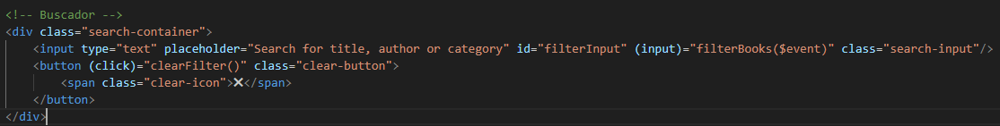

Lo cual con el estilo y el html quedo de esta manera visualmente

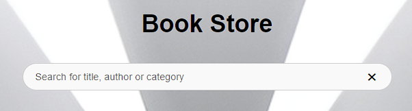

Para poder hacer que ahora al escribir filtre por titulo, autor y categoria lo que implemente es una funcion simple es que tome el valor escrito en el buscador y con book.filter filtrar por lo solicitado lo cual se agrega a los libros filtrados.
Entonces para poder demostrar como funciona vemos toda la pantalla principal de esta manera

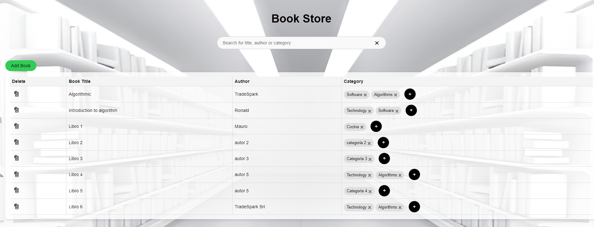

Lo que hacemos es probar por autor, ponemos "TradeSpark" y nos salen dos libros

Ahora si buscamos por categoria en este caso buscamos "Cocina" nos da el unico libro con esa categoria

Y si buscamos por el nombre del libro por ejemplo ponemos "Libro 1" nos sale especificamente ese libro

Con eso terminamos el punto uno de este challenge.

### Segundo punto (Django, Back-side):
- Dado el título de un libro y el nombre de una categoría, implementar la eliminación de esa categoría para el libro asociado.

Para este punto como dije arriba hay que tener cuidado con los libros que tienen el mismo nombre pero son de distintos autores, haciendo pruebas me di cuenta que se podia agregar el mismo libro, o sea el mismo titulo con el mismo autor, lo cual no me parecio correcto, entonces edite el serializer en el create del libro y agrege que antes de agregarlo que revise si ya existe este libro con el mismo autor

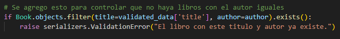
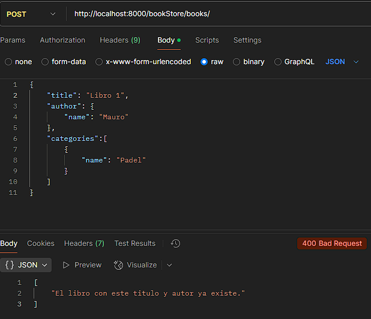

Con estas dos lineas comprobamos antes de agregar un libro que ya no exista, ya que por ejemplo agregar el title en el modelo con unique true no me parece correcto por que puede haber libros con el mismo nombre pero con otro autor.
Despues de agregar esto se realizo el "remove_category" el cual recibe el titulo del libro y el nombre de la categoria, si este libro existe y tiene asociada esa categoria la elimina perfectamente, pero, ¿y si hay mas libros con el mismo nombre? para esto lo que hice fue agregar un control mas, si existen libros devuelve que no puede eliminar ya que se encontraron mas de un libro con el mismo titulo y te muestra los libros.

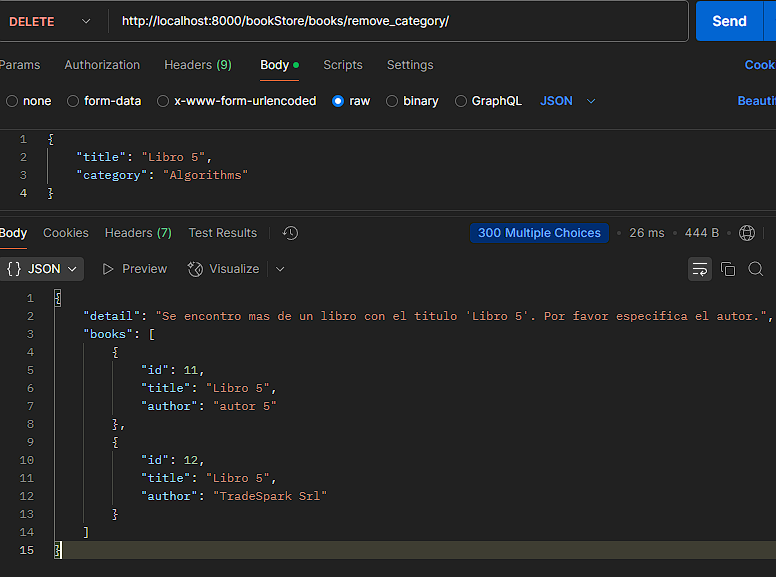

Entonces ademas de poder enviar el titulo del libro y el nombre de la categoria tambien deje que puedan agregar el author del libro que esta de forma opcional para estos casos, con este parametro ya sabemos exactamente que libro es y si existe esa categoria en el libro la elimina.

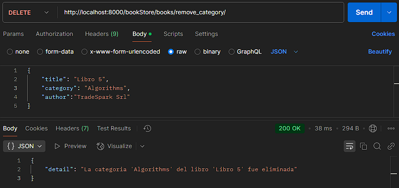

Tambien hubiera sido mas facil si se pedia el id del libro ya que con eso nos evitamos los titulos repetidos pero no es lo que pedia en el punto del challenge.

Con eso damos por finalizo el punto 2 del challenge.

### Tercer punto (Opcional):
- Implementar un botón en la sección book store que permite eliminar una categoría perteneciente a un libro. Este botón, al ser clickeado, deberá interactuar con el backend, el cual ejecutará la lógica implementada en el segundo punto para hacer efectiva la eliminación.

Para este tercer punto modifique varias cosas del front, en principio teniamos las categorias pero en un string separados por comas, lo que hice fue separarlos y agregarle una "x" a la derecha lo cual permite eliminar directamente esta categoria, y para eliminarlo le pasamos el titulo del libro, el autor y la categoria, quedando las categorias visualmente de esta manera

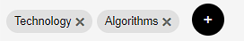

Asi directamente para eliminar una categoria tocamos en la cruz, nos pregunta si estamos seguros de que queremos eliminar esa categoria para el libro y listo!.

### Extras:

- Agregar categorias asociadas a un libro

Para poder agregar una nueva categoria asociada a un libro, lo que hice fue primero implementar la parte del backend el cual tuve que crear una funcion que reciba el id del libro y el nombre de la categoria ya que no lo podemos hacer por el modelview por que las categorias es un modelo y tenemos que especificarlo, tambien pasaria lo mismo si quisieramos hacer un update del author asociado a un libro, abria que crear un update_author en bookviewset para poder editarlo, lo que si es que tambien si la categoria que se quiere asociar si no existe la crea. En el front se agrego un "+" al final de cada listado de categorias del libro en el cual puede agregar la categoria nueva

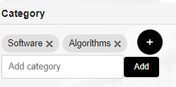

En el campo que aparece al escribir aparecen las opciones de categorias que ya existen ya que si existe podemos agregarlo directamente y es mas rapido agregarlo asi

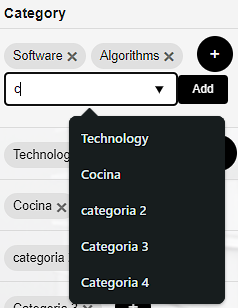

Si elegimos una categoria que ya existe como en la siguiente imagen

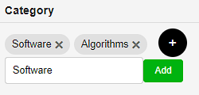

Aparece un cartel en el que avisa que esa categoria ya esta asociada a ese libro, el caso de que no existe lo agrega y se actualiza la visual con la nueva categoria.

- Agregar un libro

Agrege la opcion de poder agregar un libro, el cual sale un modal para que podamos agregar tanto el titulo, el author y las categorias asociadas al libro

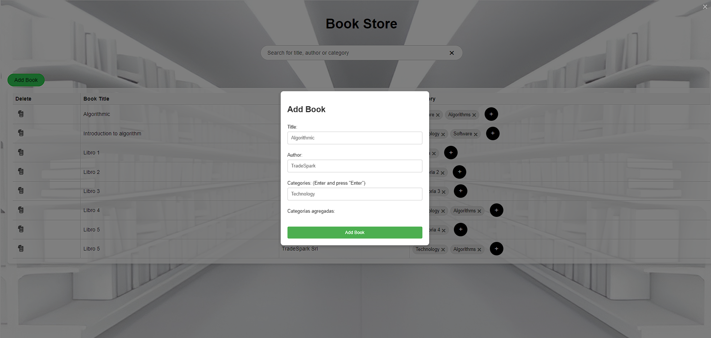

Esto en la parte del back usamos el create que ya venia con el challenge, si por ejemplo queremos agregar un libro que ya existe con el mismo titulo y el mismo autor nos salta el error indicando que ya existe 

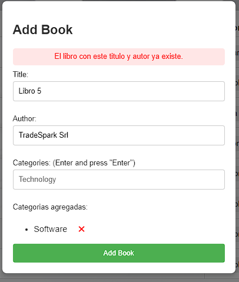

Tambien en la parte de las categorias agrege el autocompletado con las categorias que ya existen

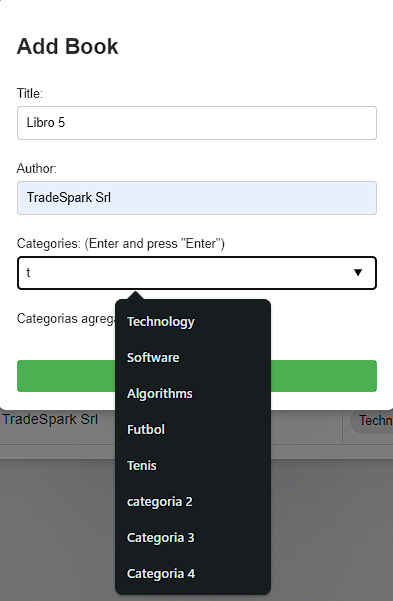

- Eliminar libro

Para eliminar libro usamos lo que nos brinda django con su modelview el cual permite ya el delete, entonces les pasamos el id y nos elimina tanto el libro como sus relaciones en las categorias o sea en la tabla intermedia manytomany que crea django, y en la parte visual agregamos un icono para que el usuario pueda presionar quedando de esta manera

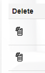

- Editar titulo del libro y nombre del autor

Tambien se agrego la opcion de poder editar el nombre del libro haciendo click en el titulo, se abre un input en el cual podemos editarlo, al igual que el nombre del autor, esto en la parte del backend usamos lo que nos brinda django haciendo uso del patch. En la parte visual queda de esta manera

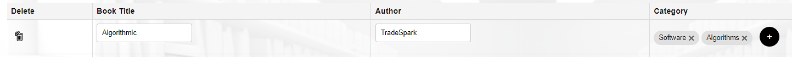

Notas: No me parecio necesario editar el modelo agregando en el name unique true, ya que al agregar las categorias actualmente si ya existe la usa y no la crea nuevamente, elimine la categoria repetida, al igual que el autor repetido. Lo ideal seria agregarlo para evitar cualquier inconveniente en el futuro.

Espero que la parte de angular este relativamente bien, seguramente se pueda modularizar mas y mejorar el codigo para que sea mas eficiente, este es mi primer contacto con angular.

Muchas gracias por analizar este codigo, espero un feedback y que nos veamos pronto!