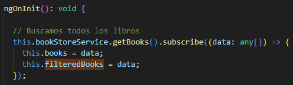
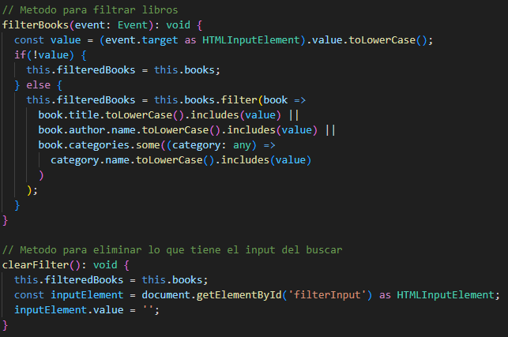

# TradeSparkChallange

## Getting started

### Prerequisites
Docker and docker-compose. for installation instructions see [here](https://docs.docker.com/install/)

#### Make sure that the docker daemon is running.

### Run the challange
1. Clone the repository
2. Run `docker-compose up` in the root directory of the repository
3. enter to localhost:4200 in your browser
4. Your has to see the following screen:

En primera instancia antes de ponerme a programar como tal, revise que venia en la base de datos, ingrese el archivo db.sqlite3 en datagrip para ver mas sencillo y rapido que tenia la bd, al principio vi que la tabla category tiene datos repetidos y al revisar el modelo en el name deberia ir unique en true para evitar categorias con el mismo nombre, al igual que con los autores que hay dos con el mismo nombre y misma bio, pero faltaba el dato de la fecha de nacimiento, ahi habria que agregar ya sea un control de que no haya authores con el mismo nombre y fecha de nacimiento, como para evitar duplicados. Despues tambien note libros con el mismo nombre pero que los autores diferentes, esto va a traer complicaciones en el punto 2 del challenge. 

Primer punto (Angular, Front-side):
- Construir un filtro sobre la tabla en la sección "Book store", el cual sea capaz de filtrar por título, autor o categoría.

En primera instancia lo que hice fue hacer la parte visual de lo que queria, el cual como dice el primer punto era un filtro sobre los libros el cual filtre por titulo, autor o categoria, entonces lo que se me ocurrio fue un buscador en donde busque por esos tres parametros

Lo cual con el estilo y el html quedo de esta manera visualmente

Para poder hacer que ahora al escribir filtre por titulo, autor y categoria lo que implemente es una funcion simple es que tome el valor escrito en el buscador y con book.filter filtrar por lo solicitado lo cual se agrega a los libros filtrados 

Entonces para poder demostrar como funciona vemos toda la pantalla principal de esta manera

Lo que hacemos es probar por autor, ponemos "TradeSpark" y nos salen dos libros

Ahora si buscamos por categoria en este caso buscamos "Cocina" nos da el unico libro con esa categoria

Y si buscamos por el nombre del libro por ejemplo ponemos "Libro 1" nos sale especificamente ese libro

Con eso terminamos el punto uno de este challenge.

Segundo punto (Django, Back-side):
- Dado el título de un libro y el nombre de una categoría, implementar la eliminación de esa categoría para el libro asociado.

Tercer punto (Opcional):
- Implementar un botón en la sección book store que permite eliminar una categoría perteneciente a un libro. Este botón, al ser clickeado, deberá interactuar con el backend, el cual ejecutará la lógica implementada en el segundo punto para hacer efectiva la eliminación.